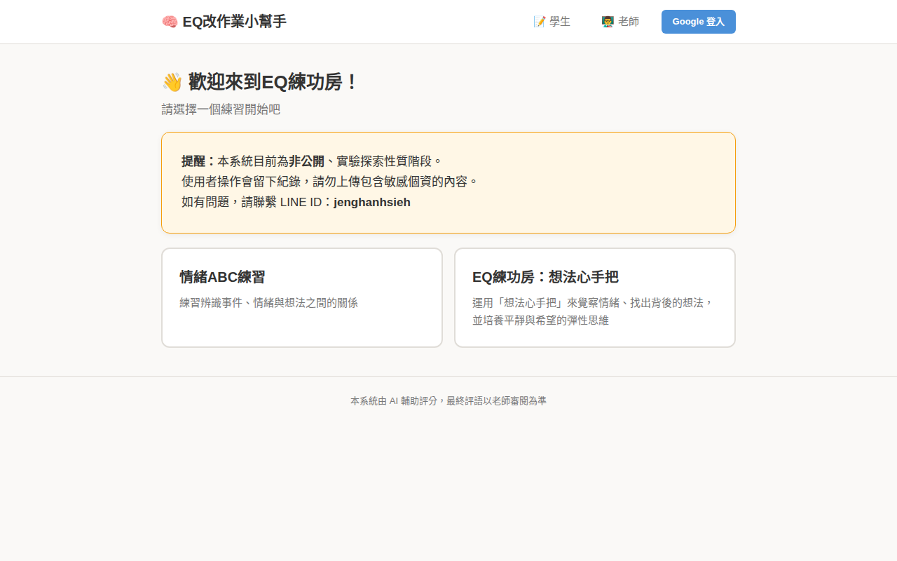
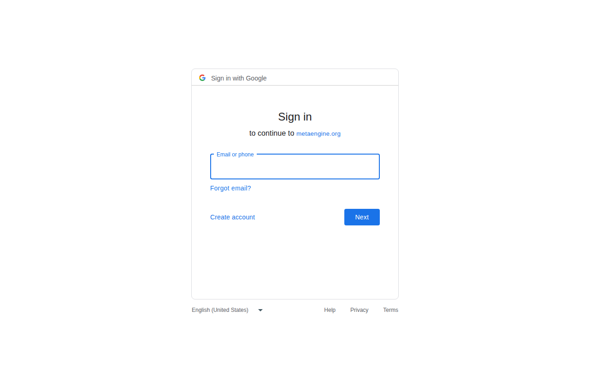
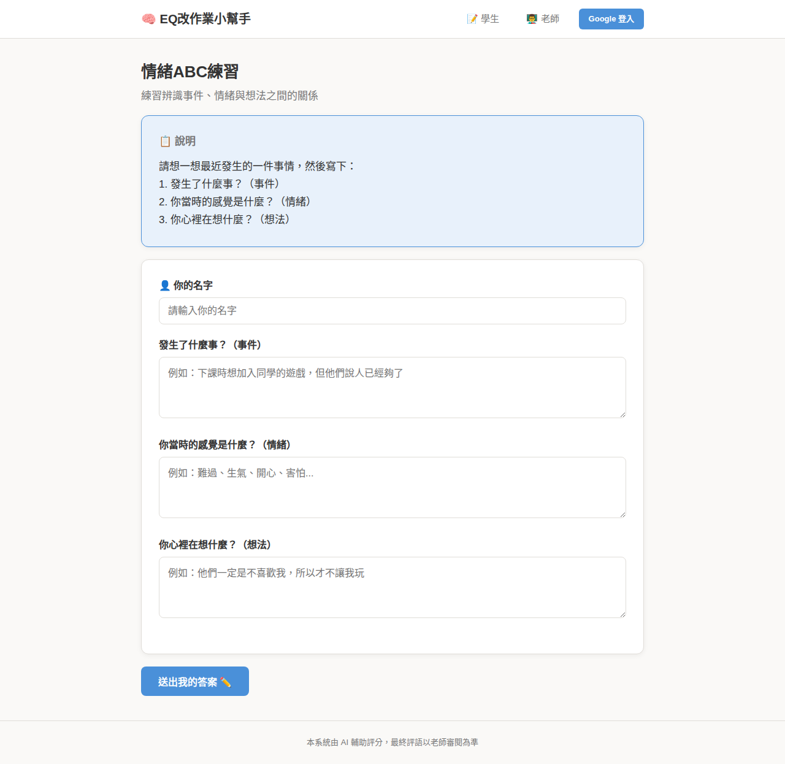
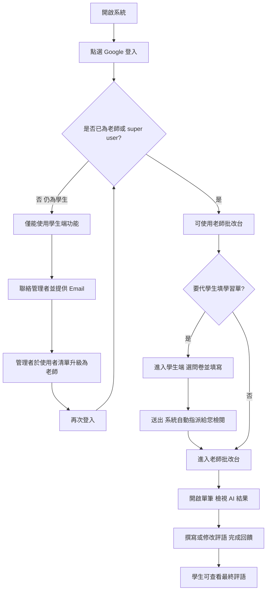

# 教師使用說明（EQ 改作業小幫手）

本文件說明老師如何從登入到完成學生學習單檢閱的完整流程。系統預設啟用 **Google 帳號登入**；若貴單位未啟用 OAuth，請依管理員指示操作。

文內截圖以正式站 **`https://eq-grader.metaengine.org`** 為例；若貴單位使用其他網址，畫面配置相同即可。

---

## 截圖檔案與重新產生

靜態圖檔置於 [`docs/images/`](./images/) 目錄。若要對自家網址重拍畫面，可安裝 Playwright 後執行（需網路）：

```bash
pip install playwright
python -m playwright install chromium
python scripts/capture_teacher_guide_screenshots.py
```

腳本內預設 `BASE` 網址可自行修改。

---

## 流程總覽

1. **登入**：使用 Google 帳號登入系統。  
2. **身分確認**：新帳號首次登入後為「學生」身分，需請 **管理者（super user）** 在「使用者清單」將您的帳號升級為「老師」。  
3. **填寫學習單**：以老師身分登入後，可到 **學生端** 代學生填寫問卷；該筆會 **自動歸您負責檢閱**。  
4. **檢閱與回饋**：在 **老師批改台** 查看 AI 批改結果，必要時修改評語並標記審閱完成。

---

## 步驟說明

### 1. 登入

- 開啟系統網址後，點選導覽列的 **「Google 登入」**（或管理員提供之登入入口）。  
- 完成 Google 授權後，系統會依您的帳號身分導向對應頁面。



點選登入後，瀏覽器會前往 **Google 帳號** 頁面完成身分驗證（畫面由 Google 提供，可能隨語系與帳號狀態略有不同）。



### 2. 通知管理者確認教師身分

- 第一次使用 Google 登入時，您的身分預設為 **學生**，**尚無法使用老師功能**（無法進入老師批改台）。  
- 請將您的 **登入用 Email** 告知 **管理者**，由管理者在 **「使用者清單」**（僅 super user 可見）中，將您的帳號 **升級為老師**。  
- 升級完成後，請 **重新登入**（或重新整理後再試一次），即可使用老師端。

> **說明：**「使用者清單」僅限管理者登入後使用，且涉及個資，本文不附截圖；實際操作請依校內管理員指示。

### 3. 登入後填寫學生學習單

- 點選導覽列 **「學生」** 進入學生填答介面。  
- 選擇問卷、輸入 **學生姓名** 並完成作答後送出。  
- **重點**：當您是以 **老師（或 super user）身分已登入** 時送出的學習單，系統會 **自動把該筆指派給您** 作為負責檢閱的老師。  
- 若學生是 **自行** 在未登入或學生身分下填寫，該筆可能 **尚未指派負責老師**；此時僅 **管理者** 可在批改台看見，並可 **批次指定** 負責檢閱的老師。

以下為 **情緒 ABC 練習** 問卷填寫頁示意（登入為老師時，頁面上方會出現「此份將歸您負責檢閱」之提示）。



### 4. 檢閱 AI 批改結果並提供回饋

- 點選 **「老師」** 進入 **老師批改台**。  
- 列表中僅會顯示 **指派給您** 的學習單（管理者可看到全部）。  
- 點 **「查看詳情」** 進入單筆頁面：  
  - 閱讀 **AI 評語** 與（可展開的）分析內容。  
  - 在 **「老師修改後的評語」** 欄位撰寫或調整給學生的回饋，送出後即視為完成審閱（學生端會依設定看到最終評語）。  
- 若需依最新模型重新跑 AI 批改，可在符合條件時使用 **「重新批改」**（會保留舊評語脈絡，詳見畫面提示）。

> **說明：**老師批改台與單筆審閱頁需以 **已升級為老師／super user** 的帳號登入後才會顯示內容；因含學生作答與評分細節，請於登入後於系統內操作，本文不附帳號內頁截圖。

---

## 流程圖（Mermaid）



---

## 常見情境

| 情境 | 說明 |
|------|------|
| 登入後無法進老師端 | 代表帳號仍為學生，請管理者升級為老師。 |
| 批改台是空的 | 可能尚無「指派給您」的學習單；可代學生填寫以自動指派，或請管理者批次指派。 |
| 想改看別班的單 | 一般老師僅能看指派給自己的單；跨班需由管理者重新指派負責老師。 |

---

## 相關技術文件

- Google OAuth 設定（管理員）：[`google-oauth-setup.md`](./google-oauth-setup.md)  
- 專案總覽與環境變數：專案根目錄 [`README.md`](../README.md)

若流程與貴校實際權限設定不同，請以管理員公告為準。
